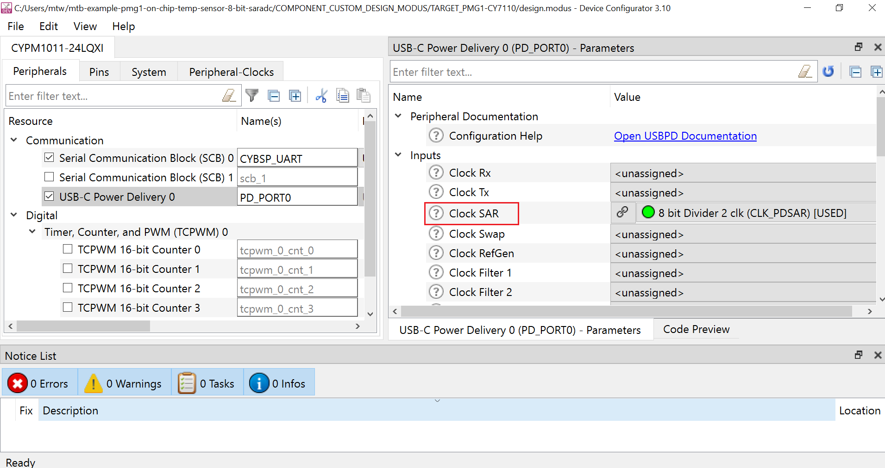
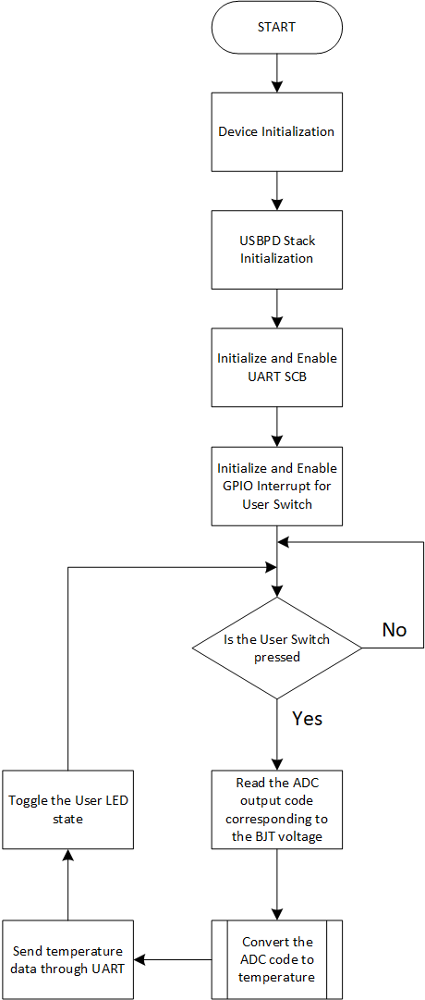

# EZ-PD&trade; PMG1 MCU: On-chip temp sensor 8-bit SAR ADC

This code example demonstrates the method of reading internal temperature of EZ-PD&trade; PMG1 MCU devices, through BJT based on-chip temperature sensor provided on PMG1 devices, using 8-bit SAR ADC in USB PD block and displays the temperature value on a UART terminal.

[View this README on GitHub.](https://github.com/Infineon/mtb-example-pmg1-on-chip-temp-sensor-8-bit-saradc)

[Provide feedback on this code example.](https://.......)


## Requirements

- [ModusToolbox&trade; software](https://www.cypress.com/products/modustoolbox-software-environment) v2.4 or later
- Set the `CY_SUPPORTED_KITS` environment variable with the value of "PMG1" to enable support for the PMG1 parts and BSPs in ModusToolbox&trade; software
- Board support package (BSP) minimum required version: 1.2.0
- Programming language: C
- Associated parts: [EZ-PD&trade; PMG1-S0 MCU](http://www.cypress.com/PMG1), [EZ-PD&trade; PMG1-S1 MCU](http://www.cypress.com/PMG1), [EZ-PD&trade; PMG1-S2 MCU](http://www.cypress.com/PMG1)


## Supported toolchains (make variable 'TOOLCHAIN')

- GNU Arm® embedded compiler v9.3.1 (`GCC_ARM`) - Default value of `TOOLCHAIN`
- Arm&reg; compiler v6.13 (`ARM`)
- IAR C/C++ compiler v8.42.2 (`IAR`)

## Supported kits (make variable 'TARGET')

- [EZ-PD&trade; PMG1-S0 prototyping kit](http://www.cypress.com/CY7110) (`PMG1-CY7110`) - Default target
- [EZ-PD&trade; PMG1-S1 prototyping kit](http://www.cypress.com/CY7111) (`PMG1-CY7111`)
- [EZ-PD&trade; PMG1-S2 prototyping kit](http://www.cypress.com/CY7112) (`PMG1-CY7112`)


## Hardware setup

1.	Connect the board to your PC using a USB cable through the KitProg3 USB connector (J1). This cable is used for programming the PMG1 device and can be used during debugging. In addition, it transfers the UART data from the serial port to the PC, to display it on a serial monitor.

2.	Connect the USB PD port (J10) to a USB-C power adapter/USB port on PC using a Type-C/Type-A to Type-C cable, to power the PMG1 device for normal operation.

3.	Connect the UART Tx and UART Rx lines from the PMG1 kit to J3.8 and J3.10 on KitProg3 respectively, to establish a UART connection between KitProg3 and the PMG1 device for the below mentioned revisions of the PMG1 prototyping kits. Note that, in this application, UART Tx line alone will be used to transmit the temperature data onto serial monitor.
     
    **Table 1. PMG1 kit UART connection**    

    | PMG1 prototyping kit  | UART Tx | UART Rx |
    | :-------       | :------------ | :----------     |
    | PMG1-CY7110 (revision 3 or lower) | J6.10 to J3.8 | J6.9 to J3.10  |
    | PMG1-CY7111 (revision 2 or lower) | J6.10 to J3.8 | J6.9 to J3.10  |
    | PMG1-CY7112 (revision 2 or lower) | J6.10 to J3.8 | J6.9 to J3.10  |

   **Note:** All prototyping kits with a higher revision have UART lines internally connected. Therefore, external wiring is not required.  

See the kit user guide for more details on configuring the board.


## Software setup

Install a terminal emulator to display the serial data. Instructions in this document use [Tera Term](https://ttssh2.osdn.jp/index.html.en).

This example requires no additional software or tools.


## Using the code example

Create the project and open it using one of the following:

<details><summary><b>In Eclipse IDE for ModusToolbox&trade; software</b></summary>

1. Click the **New Application** link in the **Quick Panel** (or, use **File** > **New** > **ModusToolbox Application**). This launches the [Project Creator](https://www.cypress.com/ModusToolboxProjectCreator) tool.

2. Pick a kit supported by the code example from the list shown in the **Project Creator - Choose Board Support Package (BSP)** dialog.

   When you select a supported kit, the example is reconfigured automatically to work with the kit. To work with a different supported kit later, use the [Library Manager](https://www.cypress.com/ModusToolboxLibraryManager) to choose the BSP for the supported kit. You can use the Library Manager to select or update the BSP and firmware libraries used in this application. To access the Library Manager, click the link from the **Quick Panel**.

   You can also just start the application creation process again and select a different kit.

   If you want to use the application for a kit not listed here, you may need to update the source files. If the kit does not have the required resources, the application may not work.

3. In the **Project Creator - Select Application** dialog, choose the example by enabling the checkbox.

4. (Optional) Change the suggested **New Application Name**.

5. The **Application(s) Root Path** defaults to the Eclipse workspace which is usually the desired location for the application. If you want to store the application in a different location, you can change the *Application(s) Root Path* value. Applications that share libraries should be in the same root path.

6. Click **Create** to complete the application creation process.

For more details, see the [Eclipse IDE for ModusToolbox&trade; software user guide](https://www.cypress.com/MTBEclipseIDEUserGuide) (locally available at *{ModusToolbox&trade; software install directory}/ide_{version}/docs/mt_ide_user_guide.pdf*).

</details>

<details><summary><b>In command-line interface (CLI)</b></summary>

ModusToolbox&trade; software provides the Project Creator as both a GUI tool and the command line tool, "project-creator-cli". The CLI tool can be used to create applications from a CLI terminal or from within batch files or shell scripts. This tool is available in the *{ModusToolbox&trade; software install directory}/tools_{version}/project-creator/* directory.

Use a CLI terminal to invoke the "project-creator-cli" tool. On Windows, use the command line "modus-shell" program provided in the ModusToolbox&trade; software installation instead of a standard Windows command-line application. This shell provides access to all ModusToolbox&trade; software tools. You can access it by typing `modus-shell` in the search box in the Windows menu. In Linux and macOS, you can use any terminal application.

This tool has the following arguments:

Argument | Description | Required/optional
---------|-------------|-----------
`--board-id` | Defined in the `<id>` field of the [BSP](https://github.com/Infineon?q=bsp-manifest&type=&language=&sort=) manifest | Required
`--app-id`   | Defined in the `<id>` field of the [CE](https://github.com/Infineon?q=ce-manifest&type=&language=&sort=) manifest | Required
`--target-dir`| Specify the directory in which the application is to be created if you prefer not to use the default current working directory | Optional
`--user-app-name`| Specify the name of the application if you prefer to have a name other than the example's default name | Optional

<br>

The following example will clone the "[Hello World](https://github.com/Infineon/mtb-example-pmg1-hello-world)" application with the desired name "MyHelloWorld" configured for the *PMG1-CY7110* BSP into the specified working directory, *C:/mtb_projects*:

   ```
   project-creator-cli --board-id PMG1-CY7110 --app-id mtb-example-pmg1-hello-world --user-app-name MyHelloWorld --target-dir "C:/mtb_projects"
   ```

**Note:** The project-creator-cli tool uses the `git clone` and `make getlibs` commands to fetch the repository and import the required libraries. For details, see the "Project creator tools" section of the [ModusToolbox&trade; software user guide](https://www.cypress.com/ModusToolboxUserGuide) (locally available at *{ModusToolbox&trade; software install directory}/docs_{version}/mtb_user_guide.pdf*).

</details>

<details><summary><b>In third-party IDEs</b></summary>

Use one of the following options:

- **Use the standalone [Project Creator](https://www.cypress.com/ModusToolboxProjectCreator) tool:**

   1. Launch Project Creator from the Windows Start menu or from *{ModusToolbox&trade; software install directory}/tools_{version}/project-creator/project-creator.exe*.

   2. In the initial **Choose Board Support Package** screen, select the BSP, and click **Next**.

   3. In the **Select Application** screen, select the appropriate IDE from the **Target IDE** drop-down menu.

   4. Click **Create** and follow the instructions printed in the bottom pane to import or open the exported project in the respective IDE.

<br>

- **Use command-line interface (CLI):**

   1. Follow the instructions from the **In command-line interface (CLI)** section to create the application, and then import the libraries using the `make getlibs` command.

   2. Export the application to a supported IDE using the `make <ide>` command.

   3. Follow the instructions displayed in the terminal to create or import the application as an IDE project.

For a list of supported IDEs and more details, see the "Exporting to IDEs" section of the [ModusToolbox&trade; software user guide](https://www.cypress.com/ModusToolboxUserGuide) (locally available at *{ModusToolbox&trade; software install directory}/docs_{version}/mtb_user_guide.pdf*).

</details>


## Operation

1. Ensure that the steps listed in the [Hardware setup](#hardware-setup) section are completed.

2. Ensure that the jumper shunt on power selection jumper (J5) is placed at position 2-3 to enable programming mode.

3. Connect the board to your PC using the USB cable through the KitProg3 USB connector (J1). This cable is used for programming the PMG1 device.

4. Program the board using one of the following:

   <details><summary><b>Using Eclipse IDE for ModusToolbox&trade; software</b></summary>

      1. Select the application project in the Project Explorer.

      2. In the **Quick Panel**, scroll down, and click **\<Application Name> Program (KitProg3_MiniProg4)**.
   </details>

   <details><summary><b>Using CLI</b></summary>

     From the terminal, execute the `make program` command to build and program the application using the default toolchain to the default target. The default toolchain and target are specified in the application's Makefile but you can override those values manually:
      ```
      make program TARGET=<BSP> TOOLCHAIN=<toolchain>
      ```

      Example:
      ```
      make program TARGET=PMG1-CY7110 TOOLCHAIN=GCC_ARM
      ```
   </details>

5. After programming the kit, disconnect the USB cable and change the position on the power selection jumper (J5) to 1-2 to power the kit through the USB PD port in operational mode.

6. Now reconnect the USB cable to KitProg3 Type-C port (J1). Open a terminal program and select the KitProg3 COM port. Set the serial port parameters to 8N1 and 115200 baud.

7. In order to start the application, power the kit through the USB PD port (J10), using the second USB cable.

8. As soon as the kit is powered through the USB PD port, the application starts printing "Press user switch (SW2) to display the Die-Temperature". Press the user switch (SW2) to display the value of die-temperature. Note that the user LED (LED3) toggles each time, indicating the temperature display on the UART terminal.

**Figure 1. Terminal data display**


## Debugging

You can debug the example to step through the code. In the IDE, use the **\<Application name> Debug (KitProg3_MiniProg4)** configuration in the **quick panel**.

Ensure that the board is connected to your PC using the USB cable through the KitProg3 USB connector and the jumper shunt on power selection jumper (J5) is placed at position 1-2.

See the "Debug mode" section in the kit user guide for debugging the application on the CY7110 prototyping kit. For more details, see the "Program and debug" section in the [Eclipse IDE for ModusToolbox&trade; software user guide](https://www.cypress.com/MTBEclipseIDEUserGuide).


## Design and implementation

This code example uses the BJT based temperature sensor (BJT NPN device) in the ADC block of PMG1 devices, by channeling it to the input of 8-bit SAR ADC under USB PD block, through firmware controlled multiplexer switches. The BJT VBE voltage, which is highly temperature dependent, is the input to the 8-bit ADC, with reference voltage of Vref = 2.0V (Bandgap reference) for PMG1-S0 and S1 and Vref = VDDA for PMG1-S2 (as Bandgap reference voltage is not available on PMG1-S2 device). The output code of the ADC is then converted to corresponding temperature value, using appropriate conversion formula and suitable calibration parameters (slope & offset values). The value of the macros in the source file, 'TEMP_SLOPE' and 'TEMP-OFFSET' can be adjusted to fine-tune the output of this application, on different PMG1 kits. The accuracy and resolution of the resultant temperature sensor is limited to around five degree celsius on PMG1-S0 and PMG1-S1 and around eight degree celsius on PMG1-S2 (due to a higher Vref value being used). The working range of the internal temperature sensor is from -40C to +85C.

- **USB-C Power Delivery 0** block is enabled under 'Peripherals' tab in Device Configurator tool. Note that, under 'Inputs' section, **Clock SAR** is assigned with '8 bit Divider 2 clk' with a divider value of 48, resulting in 1MHz clock frequency applied to the 8-bit SAR ADC as shown in the below image. USB PD Stack is also initialized with suitable parameters to allow the usage of the 8-bit SAR ADC of the USB PD block.

  **Figure 2. 8-bit SAR ADC enabled under USB-C Power Delivery 0 block**

  

- Serial Communication Block (SCB) is also enabled and configured as UART to allow serial UART communication, to send the temperature data on to the serial port.

- The user switch (SW2) is configured to trigger a GPIO interrupt in the falling edge. Upon pressing the switch, the corresponding ISR is used to save the status of the switch and trigger the SAR ADC to read the voltage of the BJT temperature sensor and convert it to the corresponding temperature value.

- The user LED (LED3) is also configured as output, which toggles the state to indicate the temperature data being sent to the UART serial port.

**Figure 3. Firmware flowchart**




### Resources and settings

**Table 2. Application resources**

| Resource  |  Alias/object     |    Purpose     |
| :------- | :------------    | :------------ |
| USB PD 0     	| 8-bit SAR ADC       	| 8-bit SAR ADC under USB PD block is used to measure BJT temperature sensor voltage|
| SCB 		| CYBSP_UART		| UART SCB block is used for serial communication, to send temperature values through serial port|
| Switch (BSP)	| CYBSP_USER_SW 	| User switch is used as a trigger to display the temperature value 	|
| LED (BSP) 	| CYBSP_USER_LED 	| User LED to show the output 	|


## Related resources

Resources | Links
-----------|------------------
Application notes |[AN232553](https://www.cypress.com/an232553) – Getting started with EZ-PD&trade; PMG1 MCU on ModusToolbox&trade; software <br> [AN232565](https://www.cypress.com/an232565) – EZ-PD&trade; PMG1 MCU hardware design guidelines and checklist
Code examples | [Using ModusToolbox&trade; software](https://github.com/Infineon/Code-Examples-for-ModusToolbox-Software) on GitHub
Device documentation | [EZ-PD&trade; PMG1 MCU datasheets](https://www.cypress.com/PMG1DS)
Development kits | Visit https://www.cypress.com/products/ez-pd-pmg1-portfolio-high-voltage-mcus-usb-c-power-delivery and select the **Kits** tab.
Libraries on GitHub | [mtb-pdl-cat2](https://github.com/infineon/mtb-pdl-cat2) – Peripheral driver library (PDL) and docs <br> [mtb-hal-cat2](https://github.com/infineon/mtb-hal-cat2) – Hardware abstraction layer (HAL) library and docs
Tools | [Eclipse IDE for ModusToolbox&trade; software](https://www.cypress.com/modustoolbox) <br> ModusToolbox&trade; software is a collection of easy-to-use software and tools enabling rapid development with Infineon&reg; MCUs, covering applications from embedded sense and control to wireless and cloud-connected systems using AIROC™ Wi-Fi & Bluetooth® combo devices.


## Other resources

Infineon provides a wealth of data at www.infineon.com to help you select the right device, and quickly and effectively integrate it into your design.

## Document history

Document title: *CE234563* - *EZ-PD&trade; PMG1 MCU: On-chip temp sensor 8-bit SAR ADC*

| Version | Description of change |
| ------- | --------------------- |
| 1.0.0   | New code example      |
------


© Cypress Semiconductor Corporation, 2022. This document is the property of Cypress Semiconductor Corporation, an Infineon Technologies company, and its affiliates (“Cypress”).  This document, including any software or firmware included or referenced in this document (“Software”), is owned by Cypress under the intellectual property laws and treaties of the United States and other countries worldwide.  Cypress reserves all rights under such laws and treaties and does not, except as specifically stated in this paragraph, grant any license under its patents, copyrights, trademarks, or other intellectual property rights.  If the Software is not accompanied by a license agreement and you do not otherwise have a written agreement with Cypress governing the use of the Software, then Cypress hereby grants you a personal, non-exclusive, nontransferable license (without the right to sublicense) (1) under its copyright rights in the Software (a) for Software provided in source code form, to modify and reproduce the Software solely for use with Cypress hardware products, only internally within your organization, and (b) to distribute the Software in binary code form externally to end users (either directly or indirectly through resellers and distributors), solely for use on Cypress hardware product units, and (2) under those claims of Cypress’s patents that are infringed by the Software (as provided by Cypress, unmodified) to make, use, distribute, and import the Software solely for use with Cypress hardware products.  Any other use, reproduction, modification, translation, or compilation of the Software is prohibited.
<br>
TO THE EXTENT PERMITTED BY APPLICABLE LAW, CYPRESS MAKES NO WARRANTY OF ANY KIND, EXPRESS OR IMPLIED, WITH REGARD TO THIS DOCUMENT OR ANY SOFTWARE OR ACCOMPANYING HARDWARE, INCLUDING, BUT NOT LIMITED TO, THE IMPLIED WARRANTIES OF MERCHANTABILITY AND FITNESS FOR A PARTICULAR PURPOSE. No computing device can be absolutely secure. Therefore, despite security measures implemented in Cypress hardware or software products, Cypress shall have no liability arising out of any security breach, such as unauthorized access to or use of a Cypress product. CYPRESS DOES NOT REPRESENT, WARRANT, OR GUARANTEE THAT CYPRESS PRODUCTS, OR SYSTEMS CREATED USING CYPRESS PRODUCTS, WILL BE FREE FROM CORRUPTION, ATTACK, VIRUSES, INTERFERENCE, HACKING, DATA LOSS OR THEFT, OR OTHER SECURITY INTRUSION (collectively, “Security Breach”). Cypress disclaims any liability relating to any Security Breach, and you shall and hereby do release Cypress from any claim, damage, or other liability arising from any Security Breach. In addition, the products described in these materials may contain design defects or errors known as errata which may cause the product to deviate from published specifications. To the extent permitted by applicable law, Cypress reserves the right to make changes to this document without further notice. Cypress does not assume any liability arising out of the application or use of any product or circuit described in this document. Any information provided in this document, including any sample design information or programming code, is provided only for reference purposes. It is the responsibility of the user of this document to properly design, program, and test the functionality and safety of any application made of this information and any resulting product. “High-Risk Device” means any device or system whose failure could cause personal injury, death, or property damage. Examples of High-Risk Devices are weapons, nuclear installations, surgical implants, and other medical devices. “Critical Component” means any component of a High-Risk Device whose failure to perform can be reasonably expected to cause, directly or indirectly, the failure of the High-Risk Device, or to affect its safety or effectiveness. Cypress is not liable, in whole or in part, and you shall and hereby do release Cypress from any claim, damage, or other liability arising from any use of a Cypress product as a Critical Component in a High-Risk Device. You shall indemnify and hold Cypress, including its affiliates, and its directors, officers, employees, agents, distributors, and assigns harmless from and against all claims, costs, damages, and expenses, arising out of any claim, including claims for product liability, personal injury or death, or property damage arising from any use of a Cypress product as a Critical Component in a High-Risk Device. Cypress products are not intended or authorized for use as a Critical Component in any High-Risk Device except to the limited extent that (i) Cypress’s published data sheet for the product explicitly states Cypress has qualified the product for use in a specific High-Risk Device, or (ii) Cypress has given you advance written authorization to use the product as a Critical Component in the specific High-Risk Device and you have signed a separate indemnification agreement.
<br>
Cypress, the Cypress logo, and combinations thereof, WICED, ModusToolbox, PSoC, CapSense, EZ-USB, F-RAM, and Traveo are trademarks or registered trademarks of Cypress or a subsidiary of Cypress in the United States or in other countries. For a more complete list of Cypress trademarks, visit cypress.com. Other names and brands may be claimed as property of their respective owners.
